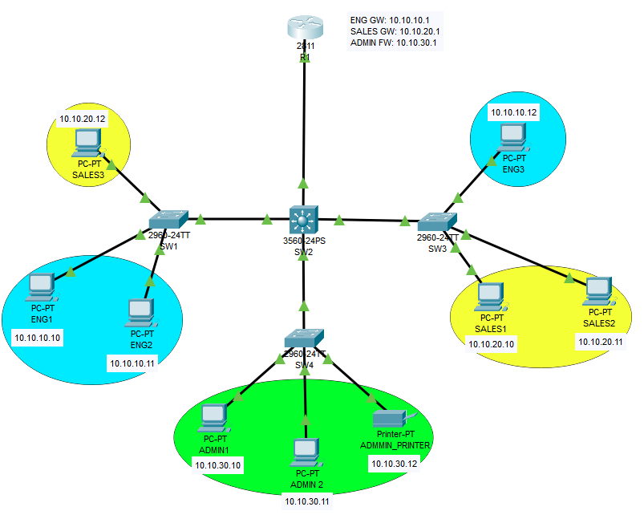

# SOHO-Network-Setup

## Abstract

This project involved the design and implementation of a secure and efficient network infrastructure using VLANs and inter-VLAN routing. VLANs were configured to segment the network, improving performance and isolating traffic. Inter-VLAN communication was enabled through a Layer 3 device using routing protocols. Trunking was implemented to facilitate VLAN communication across multiple switches, and VTP (VLAN Trunking Protocol) was configured to manage and propagate VLAN information efficiently. To enhance network security, ACLs (Access Control Lists) were applied, restricting unauthorized access and ensuring secure communication for the administrative network. This project demonstrated effective network design, configuration, and access control, emphasizing scalability, performance, and security.

